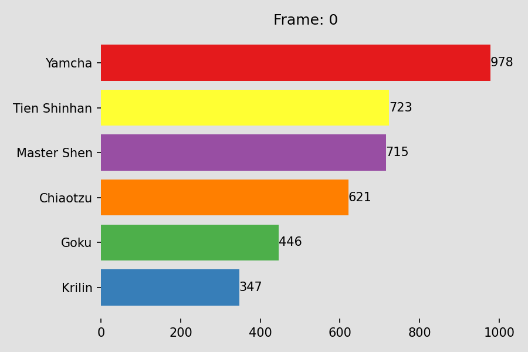

# Running Charts

Animated bar-chart races in pure matplotlib — no `bar_chart_race` dependency,
just `FuncAnimation` and a trick for making ranks move smoothly.



## The interesting part

A naive bar-chart race animates one frame per data row, so bars **teleport**
between positions whenever the ranking changes. The fix is to interpolate
twice, on two different things:

```python
# 1. Spread the real rows 10 apart, leaving 9 empty rows between each
db.index = range(0, 21 * 10, 10)
row_nums = [i for i in range(0, 210) if i % 10 != 0]
expand_df = pd.concat([db, pd.DataFrame(np.nan, index=row_nums, columns=db.columns)]).sort_index()

# 2. Interpolate the VALUES (bar length)…
expand_df = expand_df.interpolate()

# 3. …and separately interpolate the RANKS (vertical position)
rank_df = expand_df.rank(axis=1).interpolate()
```

Bar *width* comes from `expand_df`, bar *y-position* comes from `rank_df`.
Because ranks are interpolated as continuous values rather than recomputed per
frame, bars glide past each other instead of snapping — 10× the frames from the
same data, and the overtakes actually read as overtakes.

## Layout

| Path | Contents |
|---|---|
| `RankingCharts/Countries.ipynb` | The main notebook — world population race, with the rank-interpolation method |
| `RankingCharts/Source.ipynb` | Scratch / reference notebook |
| `RankingCharts/main.py` | Standalone script that renders `DrgBl.gif` |
| `RankingCharts/world_population.csv` | Population by country over time |
| `RankingCharts/UNations_Pop:Fert:Life_exp_data.xlsx` | UN population, fertility and life-expectancy data |
| `RankingCharts/dragon_ball_pl.csv` | Power levels over the series — the toy dataset |
| `RankingCharts/DrgBl.gif` | Rendered output |
| `RankingCharts/Life expectancy … .mov` | Life expectancy 1950–2100, rendered |

## Running

```bash
pip install pandas numpy matplotlib openpyxl
cd RankingCharts
python main.py          # writes DrgBl.gif
```

Saving a GIF needs a matplotlib writer — `pillow` works out of the box; for
`.mov`/`.mp4` install `ffmpeg`.

## Notes

- `Countries.ipynb` is the more developed of the two paths; `main.py` is the
  earlier, simpler version that renders the Dragon Ball GIF.

## Still to do

From the original notes:

- Split by year
- Per-year linear interpolation
- A column for grouping countries by world region

## References

- [Bar chart race in Python](https://pythoninoffice.com/how-to-create-the-bar-chart-race-plot-in-python/)
- [Animated visualisations in Tableau](https://www.rigordatasolutions.com/post/creating-animated-visualizations-in-tableau)
